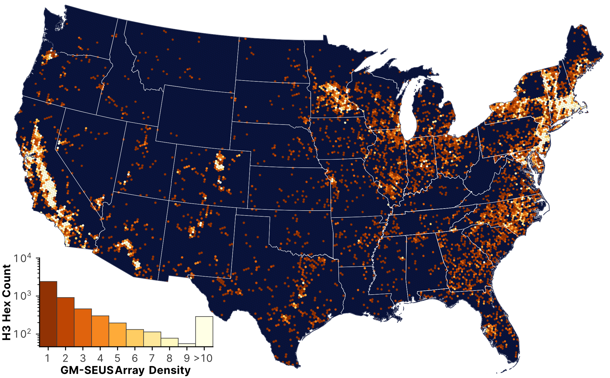
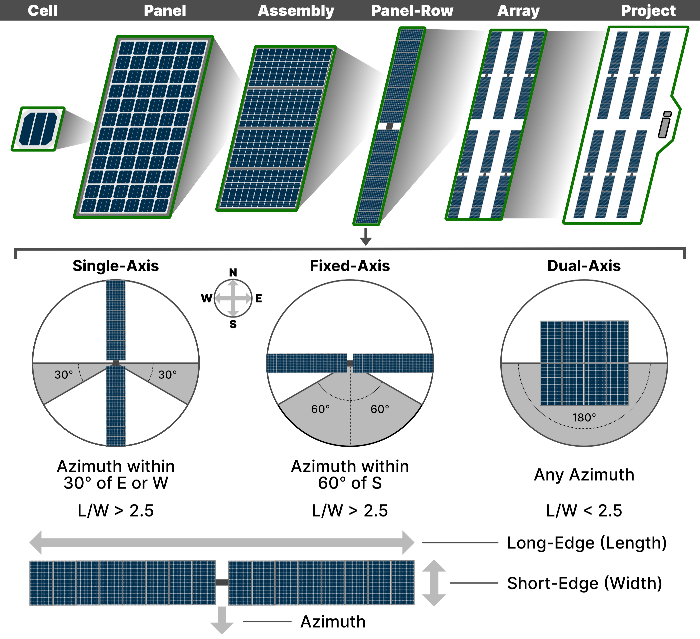
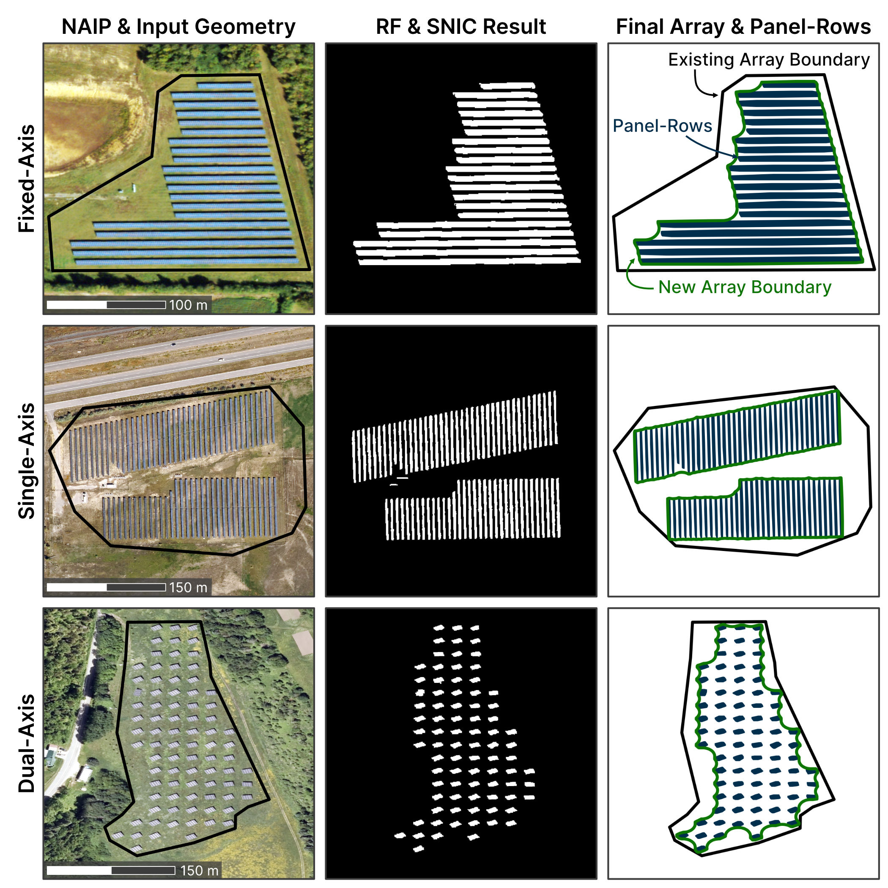
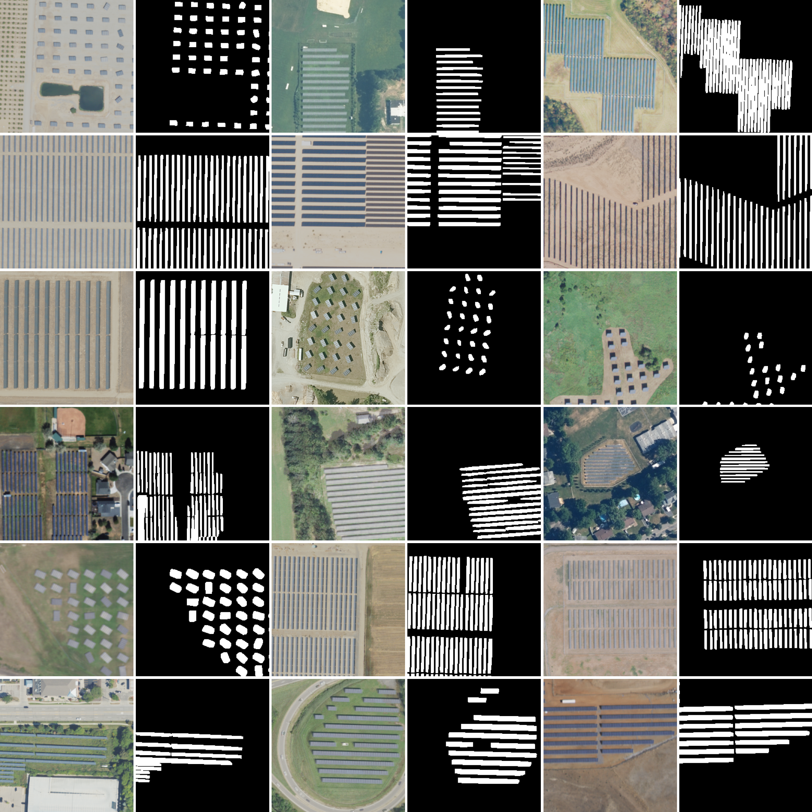

    
 

# A comprehensive ground-mounted solar energy dataset with sub-array design metadata in the United States
Code repository for creating and maintaining the Ground-Mounted Solar Energy in the United States (GM-SEUS) spatiotemporal dataset of solar arrays and panel-rows using existing datasets, machine learning, and object-based image analysis to enhance existing sources. A paper in is preparation for this dataset. 

## Current Version Notes
This is the initial release of GM-SEUS (version 1.0). All input datasets and solar panel-row delineation results are up-to-date through December 11th, 2024. 

# Product Description

## Overview

Solar energy generating systems are a critical component of net-zero infrastructure, yet comprehensive datasets characterizing systems remain incomplete or not publicly available, particularly at the sub-array level. Leveraging the best freely available existing solar datasets in the US with object-based image analysis and machine learning, we present the Ground-Mounted Solar Energy in the United States (GM-SEUS) dataset, a harmonized, open access, and regularly updated geospatial and temporal repository of solar energy arrays and panel-rows. GM-SEUS v1.0 includes nearly 15,000 commercial- and utility-scale ground-mounted solar photovoltaic and concentrating solar energy arrays (186 GWDC) covering 2,950 km2 and includes 2.92 million unique solar panel-rows (466 km2) within those arrays. We use these newly compiled and delineated solar panel-rows to harmonize and independently estimate several value-added attributes to existing datasets, enhancing consistency across spatiotemporal attributes. Value-added attributes include installation year, azimuth, mount technology, panel-row area and dimensions, inter-row spacing, ground cover ratio, tilt, and installed capacity. By estimating and harmonizing these spatial and temporal attributes of the distributed US solar energy landscape, GM-SEUS supports diverse applications in renewable energy modeling, ecosystem service assessment, and infrastructural planning. 

## Approach

GM-SEUS is both a harmonization of existing solar energy array data in the US and a new product of solar panel-row spatiotemporal information, providing new insights on perviously under-reported metadata attributes. We used a combination of machine learning and geographic object-based image analysis, often referred to as GEOBIA or OBIA. Importantly, this new dataset is publicly available, with code available here and the associated Zenodo Repository containing all final products of GM-SEUS v1.0 and locations for source datasets.

We defined a solar array spatial footprint as: _adjacent, existing, and connected rows of solar panel-rows (PV or CSP) of the same installation year, and the row-spacing between them_. Panel-rows are defined by: _spatially-unique collection of one or more panel-assemblies connected by proximity and often sharing one mount, but not necessarily electrically connected_. Datasets with existing solar array boundaries in the United States are the USPVDB, TZ-SAM, OpenStreetMap, and two regional datasets in California’s Central Valley and the Chesapeake Bay area. Datasets containing value-added attributes and point-locations included the NREL Agrivoltaic Map from the InSPIRE initiative, the LBNL Utility-Scale Solar, 2024 Edition Report, IEA and NREL SolarPACES initiative, Global Energy Monitor’s Global Solar Power Tracker, and The World Resources Institute's Global Power Plant Database. 

We removed repeat geometries in order of spatial quality in relation to our deviation of an array, and georectified existing point-location sources within 190 m of existing array shapes. For points without a georectified array boundary, we manually annotated new array boundaries or rectify existing boundaries outside 190 m. Finally, rooftop solar arrays were removed by intersection with Global Google-Microsoft Open Buildings Dataset (2018). The conceptual hierarchy of system boundaries and logic behind mount classification are shown below. 

The above image is the conceptual hierarchical system boundaries when considering solar infrastructure and solar panel-row metadata logic, critical for understanding this dataset and approach. Green boundaries indicate the conceptual boundary for each term. This study reports the geospatial and temporal characteristics of panel-rows and arrays. A panel-row a spatially-unique collection of one or more panel-assemblies connected by proximity and often sharing one mount, but not necessarily electrically connected. An array is composed of one or more adjacent rows of the same installation year, and the row-spacing between them. The cell, panel, assembly and project are not the system boundaries focused on in this study. The ratio of the long-edge to the short-edge is the L/W ratio. Azimuth is initially defined as the primary cardinal direction of the short-edge vector (face of the panel-row) in the minimum bounding rectangle in south facing angles given that all solar arrays were in the northern hemisphere.

Existing solar panel-rows datasets were compiled from OpenStreetMap and Stid et al. (2022). To acquire panel-rows within solar array boundaries without existing panel-row information we used National Agriculture Imagery Program (NAIP) imagery and applied unsupervised object-based image segmentation and supervised machine learning approaches. We classified NAIP imagery using a Random Forest model and four spectral indices with displayed utility in classify solar energy: normalized difference photovoltaic index (NDPVI), normalized blue deviation (NBD), brightness (Br), normalized difference vegetation index (NDVI), normalized difference water index (NDWI). We trained the model using 2,000 panel-row samples from Stid et al. (2022), and 10,000 landcover validation points from Pengra et al. (2020). 

Spatial context was incorporated using object-based imagery analysis methods, including using simple non-iterative clustering (SNIC) of each spectral index’s grey-level co-occurrence matrix (GLCM) sum average. We then clustered SNIC values using X-means clustering, and use the Random Forest model to classify pixel-clusters. We also removed low-quality panel-rows using several object-based metrics of geometrical similarity including minimum (15 m2) and maximum (2000 m2) panel-row area, perimeter-area-ratio, area-bounding-box, long-edge to short-edge ratios, and compactness, all relative to metric values form existing solar panel-row. The logic behind panel-row and new array boundary delineation is shown below. 

## Source Datasets

### Array Polygon-Level Data

* **United States Solar Photovoltaic Database (USPVDB)**: Downloaded from [USPVDB Portal](https://eerscmap.usgs.gov/uspvdb/data/), Last Download: 10-11-2024 (Up-to-date as of 12-11-2024), Version 2.0
* **California's Central Valley Photovoltaic Dataset (CCVPV) Arrays and Panels**: Downloaded from [figshare](https://doi.org/10.6084/m9.figshare.23629326.v1), Last Download: 07-18-2024 (Up-to-date as of 12-11-2024), Version 1.0
* **Chesapeake Watershed Solar Data (CWSD) Arrays**: Downloaded from [OSFHOME](https://osf.io/vq7mt/), Last Download: 12-01-2024 (Up-to-date as of 12-11-2024), We downloaded derived polygons as well as manually annotated training polygons, and preferenced training polygons over derived for their completeness and quality, No Version details
* **OpenStreetMap Solar Panels and Arrays (OSM)**: Array and panel objects were downloaded _osmnx_ package in `script0_getOSMdata.ipynb`, Last OSM scrape: 12-11-2024,
  * Previously, we used data from **Harmonzied Global Wind and Solar Farm Locations (HGLOBS)** Downloaded from [figshare](https://doi.org/10.6084/m9.figshare.11310269.v6)
* **TransitionZero Global Solar Asset Mapper (SAM)**: Downloaded from [TZ-SAM Portal](https://zenodo.org/records/11368204), Last Download: 12-11-2024, Other information: [Website](https://solar.transitionzero.org/), [Viewer](https://solar-map.transitionzero.org/), [SciData Preprint](https://zenodo.org/records/11368204/files/tz-sam_scientific_data.pdf?download=1), Version Q3-2024 (Version 2)
  * Follow-on project containing all information from [Kruitwagen et al., 2021](https://zenodo.org/records/5005868). 

### Array Point-Level Data

* **NREL Innovative Solar Practices Integrated with Rural Economies and Ecosystems (InSPIRE) Database**: Downloaded from [InSPIRE Portal](https://openei.org/wiki/InSPIRE/Agrivoltaics_Map), Last Download: 12-11-2024,
* **LBNL Utility-Scale Solar (USS), 2024 Edition**: Downloaded from [LBNL Utility-Scale Solar Portal](hhttps://emp.lbl.gov/utility-scale-solar/), Last Downloaded: 11-16-2024 (Up-to-date as of 12-11-2024), Large excel report, project level data was copied from original report .xlsx to a new .csv from Individual_Project_Data tab
* **NREL PV Data Acquisition (PV-DAQ) Database**: Downloaded from [PV-DAQ Portal - Available Systems Information](https://data.openei.org/submissions/4568), and [PVDAQ Data Map](https://openei.org/wiki/PVDAQ/PVData_Map), Last Downloaded: 07-23-2024 (Up-to-date as of 12-11-2024)
* **International Energy Agency (IEA) & NREL Solar Power and Chemical Energy System (SolarPACES) Database**: Downloaded from [Project Page](https://solarpaces.nrel.gov/), Last Downloaded: 07-29-2024 (Up-to-date as of 12-11-2024), More information at [US CSP Project Pages](https://solarpaces.nrel.gov/by-country/US)
  * While SolarPACES is the overarching project (and how we refer to the dataset here), the product is called [CSP.guru](https://csp.guru/)
* **Global Solar Power Tracker (GSPT) from Global Energy Monitor (GEM) and TransistionZero**: Downloaded from [GEM Portal](https://globalenergymonitor.org/download-data-success/), Last Downloaded: 07-24-2024 (Up-to-date as of 12-11-2024), Access request required.
* **World Resource Institute (WRI) Global Power Plant Database (GPPDB)**: Downloaded from [WRI Portal](https://datasets.wri.org/dataset/globalpowerplantdatabase), Last Downloaded: 07-30-2024 (Up-to-date as of 12-11-2024), Version 1.3.0

## Codebase Description:

All code used in the acquisition and development of this dataset is available in this [Github repository](https://github.com/stidjaco/GMSEUS). Files are ipynb or js files, where js files are JavaScript files intended to be run in the [GEE code editor](https://code.earthengine.google.com/). Files are named in order of operation (e.g., `script1` < `script2`).

### The GM-SEUS open code repository contains the following files

General Code Files: All file require the completion of all prior files for inputs. 
* `config.txt`: Config file containing variable constants used throughout processing.
* `script0_getOSMdata.ipynb`: Python file for pulling and processing OSM data for each state. No required inputs.
* `script1_prepareExistingSolarDB.ipynb`: Python file for compiling and harmonizing existing solar databases.
* `script2_digitizeSolarLocations.js`: GEE file for preparing manual digitization of solar array point data not able to be georectified to existing array polygon data.
* `script3_compileGetGroundMounted.ipynb`: Python file for compiling existing and digitized boundaries, and removing rooftop mounted solar arrays. 
* `script4_getSolarPanels.js`: GEE file for acquiring NAIP imagery within array bounds and extracting panel-row boundaries if they exist in available imagery. 
* `script5_processSolarPanels.ipynb`: Python file for compiling and quality control of solar panel-row objects. File also creates new array boundaries.
* `script6_getInstallationYear.js`: GEE file for applying LandTrendr temporal segmentation within array boundaries to acquire a year of change (requires `scriptLandTrendrSolarIndex.js`).
* `script7_prepAttributes.ipynb`: Python file for preparing and harmonizing all final GM-SEUS attributes (except tilt).
* `script8_tiltEstimation.ipynb`: Python file for using _pvlib_ to estimate the optimum tilt angle of fixed-axis (and mixed-axis) arrays.
* `script9_prepRepository.ipynb`: Python file for preparing the final checks and exports for upload to the Zenodo Repository.
* `script10_technicalValidation.ipynb`: Python file for processing technical validation of GM-SEUS.

Environment Files: 
* `BigPanel.yml`: General python environment for all ipynb files except `script3` and `script8`.
* `BigPanelGEE.yml`: Python environment for `script3` that requires GEE access and cloud repository. 
* `BigPanelTilt.yml`: Python environment for `script8` that requires pvlib integration and thus a different version of python.  

Supplementary Files: 
* `script7a_validateInstYrImagery.js`: GEE file for manual validation of installation year using available NAIP, Sentinel-2, and Landsat 7 ETM+ imagery. 
* `script7b_validateInstYrTimeSeries.js`: GEE file for LandTrendr provided User-Interface (UI) file with solar PV indices included. 
* `scriptLandTrendrSolarIndex.js`: GEE file for LandTrendr temporal segmentation, modified to include solar indices (see LandTrendr_LICENSE).
* `scriptTrainRF.js`: GEE file for compiling and assessing the new landcover training dataset to classify solar panel-rows in NAIP imagery.
* `scriptGetLabeledImages.js`: GEE file for preparing and exporting 4-band NAIP and a GM-SEUS panel-row burned in imagery (as a 5th band) over an array to generate labeled imagery. 
* `script_createLabeledImages.ipynb`: Python file for taking in whole labeled images from `scriptGetLabeledImages.txt` and splitting into 256 x 256 pixel tiled images and masks. 
* `scriptPlot_maps.ipynb`: Python file for printing and export relevant result maps.
* `script_spatialValidation.ipynb`: Python file for initial exploration of spatial accuracy approaches.
  
## Dataset Description: 
Files are within subdirectories **GPKG**, **SHP**, and **CSV**. All data products are available in the Zenodo Repository. All input datasets can be downloaded from source files described in the associated paper, at the top of this document, at the top of `script1`, and in the Zenodo data README. All intermediate products are available upon request, and are automatically generated in the processing of the code repo. Geospatial files in the final database are provided as shapefiles, geopackages, and comma separated values. 

### The GM-SEUS v1.0 data repository contains the following files

* **GMSEUS_Arrays_Final**: Final array dataset containing boundaries from existing datasets and enhanced by buffer-dissolve-erode technique with GM-SEUS panel-rows containing all array-level attributes (NAD83), geopackage, shapefile, and csv
* **GMSEUS_Panels_Final**: Final panel-row dataset containing boundaries from existing datasets and newly delineated GM-SEUS panel-rows containing all panel-row-level attributes (NAD83),  geopackage, shapefile, and csv
* **GMSEUS_NAIP_Arrays**: All array boundaries created by buffer-dissolve-erode method of newly delineated (NAIP) GM-SEUS panel-rows (NAD83),  geopackage, shapefile, and csv
* **GMSEUS_NAIP_Panels**: All newly delineated panel-row boundaries (NAD83), geopackage, shapefile, and csv
* **GMSEUS_NAIP_PanelsNoQAQC**: All newly delineated panel-rows from NAIP imagery without any quality control (EPSG:102003),  geopackage, shapefile, and csv
* **NAIPtrainRF**: Training dataset of 12,000 NAIP training points (2,000 class-2) containing class values, spectral index values, the year of NAIP imagery accessed, and point coordinates (WGS84), comma separated values
* **NAIPclassifyRF**: Training dataset of 12,000 NAIP training points (2,000 class–1) containing class values, spectral index values, the year of NAIP imagery accessed, and point coordinates (WGS84). Classes are solar: 0, developed: 1, vegetated: 2, water: 3, snow/ice: 4, barren/sparse vegetation: 5, comma separated values
* **LabeledImages**: Directory containing image and mask subdirectories with ~17,500 input and target images for deep learning pattern recognition applications, GeoTIFF

### We provide the following attribute fields in GM-SEUS Final Arrays

* **arrayID**: unique numeric ID of each solar array in GM-SEUS, unitless  
* **Source**: array boundary source from existing datasets, unitless  
* **nativeID**: numeric ID of each solar array from the source spatial dataset if an indexing system existed, unitless  
* **latitude**: latitude of the array boundary centroid (NAD83), decimal degrees  
* **longitude**: longitude of the array boundary centroid (NAD83), decimal degrees  
* **newBound**: binary, whether the array boundary was derived from the existing data sources (0) or from a buffer-dissolve-erode of panel-rows following our definition of an array boundary (1), unitless  
* **totArea**: total land footprint of panel-rows and the space between them, m²  
* **totRowArea**: If **numRow** is greater than 0, sum of rowArea within an array. Otherwise, estimated based on **totArea** and **GCR1** estimation where no panel-rows were detected, m²  
* **numRow**: number of panel-rows within an array, m²  
* **instYr**: installation year from existing sources, with gaps filled in by **instYrLT**, year  
* **instYrLT**: LandTrendr-derived installation year independent of any data source other than Landsat spectral trajectory, year  
* **capMW**: installed peak capacity from existing sources, with gaps filled in by **capMWest**, MWDC or MWth  
* **capMWest**: estimated installed peak capacity derived from capacity to panel-row area relationships described in Eq. 11-14 independent of any data source, MWDC or MWth  
* **modType**: reported panel-row (module) technology at the array level (c-si, thin-film, csp). If unreported, assumed to be c-si, unitless  
* **effInit**: initial panel-rows efficiency from existing sources with gaps filled in based on efficiency estimation from **modType** and **instYr** taken from the annual Tracking the Sun report, %  
* **GCR1**: 0-1, the ratio of **totRowArea** to the total area of panel-rows and the space between them. For arrays with complete panel delineation and arrays where **newBound** is 1, this is equivalent to **totArea**. This is also called packing factor. If **numRow** is greater than 0, **GCR1** is an actual **GCR1** for the array. Otherwise, **GCR1** is estimated by linear regression of latitude and longitude by mount and module type, unitless  
* **GCR2**: 0-1, the ratio of the average width of the panel-row short edge (**rowWidth**) to the horizontal ground distance between identical panel-rows points, defined as the sum of **widthAvg** and **rowSpace**. If **numRow** is greater than 0, **GCR2** is an actual **GCR2** for the array. Otherwise, **GCR2** is estimated by linear regression of latitude and longitude by mount and module type, unitless  
* **mount**: mount technology derived from the azimuth and geometry of each panel-row within the array or from existing sources, with preference given to newly derived mount technology. Either `fixed_axis`, `single_axis`, `dual_axis`, `mixed`, or `mixed_` with a lower-case letter denoting the mixed mounts (e.g., `mixed_fs`), unitless  
* **tilt**: panel-row tilt for fixed-axis arrays (including arrays with mixed-mounting) from existing sources and filled in by **tiltEst**, degrees from zenith  
* **tiltEst**: estimated panel-row tilt for fixed-axis arrays (including arrays with mixed-mounting) estimated using pvlib, degrees above horizontal
* **avgAzimuth**: median estimated azimuth of panel-rows within array bounds or reported azimuth from existing sources, with preference given to newly estimated azimuth. For single-axis tracking arrays, this is the cardinal direction of the long edge. For all other mount types, this is the cardinal direction of the panel-row face, degrees from north  
* **avgLength**: median length of the long edge of panel-rows within an array, meters  
* **avgWidth**: median length of the short edge of panel-rows within an array, meters  
* **avgSpace**: median spacing between the solar array rows, in meters, between edges of the panel-row projected onto the ground, meters  
* **STATEFP**: unique geographic identifier for the U.S. Census Bureau state entity, unitless  
* **COUNTYFP**: unique geographic identifier for the U.S. Census Bureau county entity, unitless  
* **geometry**: best new or available geometry matching the array definition which contains panel-rows and the space between them, derived from existing sources (**newBound = 0**) or from a buffer-dissolve-erode of newly delineated panel-rows (**newBound = 1**), meters  
* **version**: GM-SEUS version in which the array geometry and attributes are derived. Each subsequent version will re-derive new geometries and the best delineation from each version will be selected, unitless  

### We provide the following attribute fields in GM-SEUS Final Panel-Rows

* **panelID**: unique numeric ID of the panel-row in GM-SEUS, unitless  
* **arrayID**: unique numeric ID of each solar array in GM-SEUS that the panel-row is associated with, unitless  
* **Source**: panel-row boundary source from OSM, CCVPV, or GM-SEUS, unitless  
* **rowArea**: top-down or apparent panel-row area directly from the output of image classification, m²  
* **rowWidth**: length of the short edge of the panel-row, meters  
* **rowLength**: length of the long edge of the panel-row, meters  
* **rowAzimuth**: azimuth of the panel-row, with 0 at North, degrees  
* **rowMount**: mount technology (fixed-axis, single-axis, or dual-axis) of the panel-row, unitless  
* **rowSpace**: the inter-row spacing between the panel-row and the nearest panel-row in the azimuthal direction (fixed- and single-axis) or any direction (dual-axis), meters  
* **geometry**: top-down or perceived geometry, meters  
* **version**: GM-SEUS version in which the panel-row geometry and attributes are derived. Each subsequent version will re-derive new geometries and the best delineation from each version will be selected, unitless  

## Labeled Images for Deep Learning and Pattern Recognition
To add value to the dataset, we generate ~17,500 labeled images intended for deep learning and pattern recognition applications. We generated labeled imagery for arrays within GM-SEUS that contained NAIP generated panel-rows (CCVPV or gmseus Source) and with at least 10 identified panel-rows. We also only allowed imagery within the array where panels were present, to reduce panel-row omission error inclusion into the image dataset. Images and masks are provided at 256x256 pixel dimensions. We allowed arrays to contain random point centered image windows equal to 50% of the panel-row containing array area divided by tiled area (e.g., 377,500 m² / 23,593 m² * 0.5 = ~8 tiles). This resulted in ~17,500 images and masks over 4,605 arrays.

Three columns of six examples containing inputs or images (left) and targets or masks (right) for fixed-, single-, and dual-axis mounted arrays contained within GM-SEUS. Note, this data was not used to create GM-SEUS, but is provided as a value added product within the data repository.
